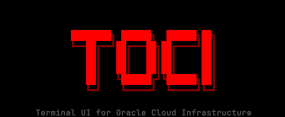
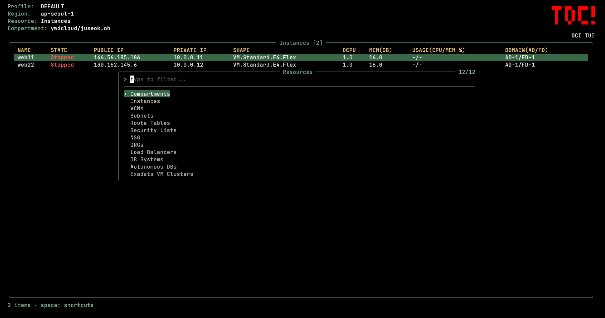
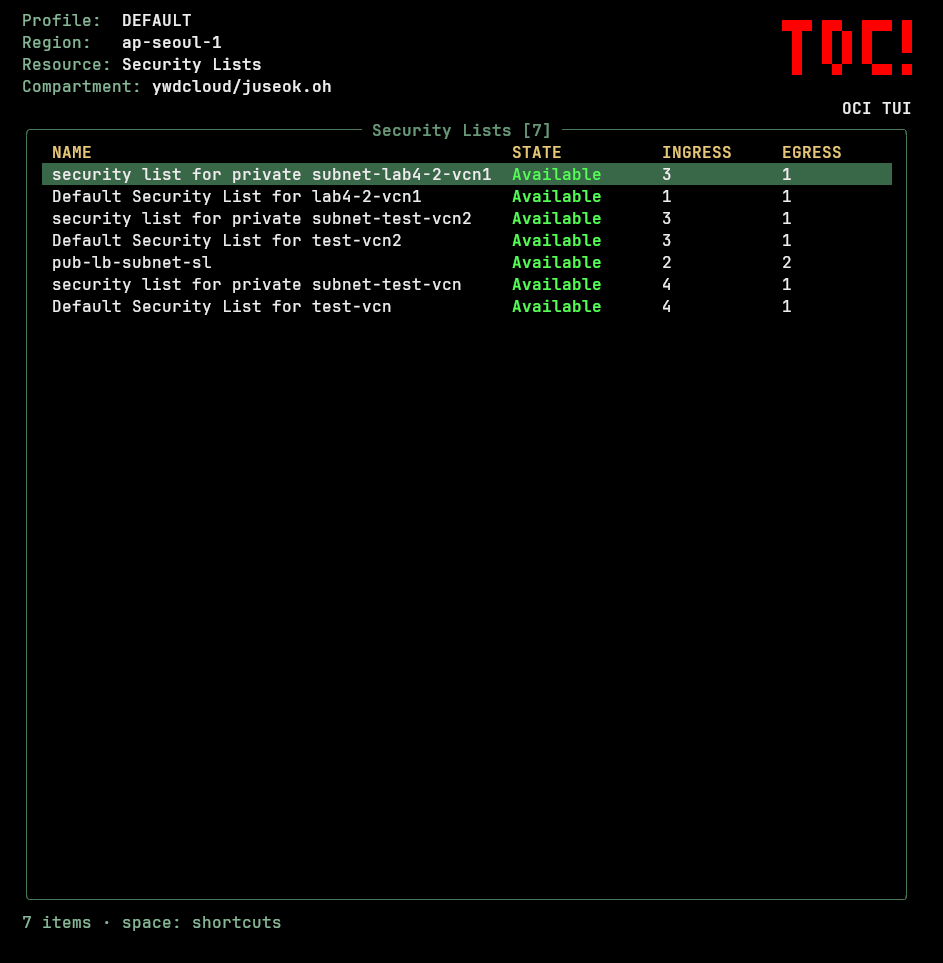
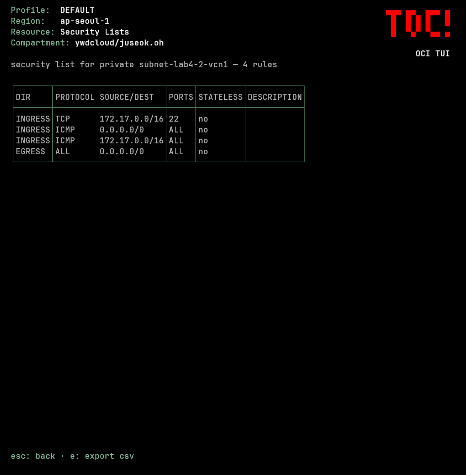

<p align="center">
  
</p>

# toci - Terminal UI for OCI

터미널을 벗어나지 않고 Oracle Cloud Infrastructure(OCI)의 컴파트먼트, 컴퓨트, 네트워크, 데이터베이스 리소스를 빠르게 탐색/관리할 수 있는 키보드 중심 터미널 UI입니다.

---

[](LICENSE)
[](https://go.dev/)
[English](README.md)

---

## 스크린샷

<p align="center">
  
</p>

<p align="center">
  
  
</p>

기본값은 **읽기 전용**입니다. 쓰기 액션(인스턴스 start/stop, Bastion SSH 세션)은 명시적인 `--write` 플래그와, 리소스 이름을 직접 타이핑해야 하는 확인 절차 뒤에만 동작합니다.

## 기능

- **리소스 검색** — `f`를 누르면 모든 리소스 종류를 퍼지 검색하는 2단 창(목록 + 설명)이 뜨고, 바로 진입할 수 있습니다.
- **컴파트먼트 전환** — `c`를 누르면 퍼지 컴파트먼트 트리 피커가 뜹니다. Compartments 자체는 정보 조회 전용(`Enter`/`d`로 상세 보기)입니다.
- **VCN/DRG 스코프 피커** — VCN 행에서 `Enter`(또는 `i`)를 누르면 그 VCN의 Subnet/Route Table/Security List/Gateway만 모은 피커가 뜨고, DRG 행에서는 그 DRG의 Attachment/Route Table/Route Distribution만 모은 피커가 뜹니다.
- **VCN 스코프 필터링** — VCN을 하나 고르면 그 VCN에 속한 모든 리소스(Subnet, Route Table, Security List, NSG, Instance, Load Balancer, Internet/NAT/Service Gateway, OKE Cluster, DB System, Autonomous DB, Exadata VM Cluster)가 자동으로 그 VCN 기준으로 필터링됩니다.
- **리소스 23종**: Compute, Network, Gateways, Storage, Containers, Database 카테고리로 나뉘어 있습니다 — 전체 목록은 `f` 검색에서 확인 가능합니다.
- **Instance 테이블** — 실시간 CPU%/MEM%(OCI Monitoring), OCPU/메모리 스펙, OS 이미지 버전, 서브넷, Public/Private IP, 색상으로 표시되는 STATE 컬럼(모든 리소스 종류에서 정상/실패/주의 상태를 초록/빨강/노랑 텍스트로 표시 — [docs/COLOR_SYSTEM.md](docs/COLOR_SYSTEM.md) 참고).
- **규칙 뷰어** — Security List/Route Table/NSG/DRG Route Table 행에서 `v`를 누르면 ingress/egress 또는 route 규칙을 화면 하단에 표 형태로 띄워줍니다(중첩된 YAML 대신).
- **CSV export** (UTF-8 BOM 포함, 엑셀에서 한글 안 깨짐) — 현재 화면에 보이는 내용 그대로 저장 (규칙 표도 export 가능).
- **Mermaid 다이어그램 export** — VCN의 서브넷별 구성(Instance/DB System/Autonomous DB/Exadata VM Cluster)과 그 VCN에 붙어있는 DRG까지 `graph TD` + 중첩 `subgraph` 문법의 `.mmd` 플로우차트로 생성합니다.
- **리소스 맵** — AWS 콘솔 스타일로 VCN의 서브넷, 그 서브넷들이 쓰는 라우팅 테이블, 그 라우팅 테이블이 가리키는 인터넷/NAT/서비스/로컬 피어링 게이트웨이와 DRG를 컬럼별로 연결선과 함께 앱 안에서 바로 보여줍니다.
- **LazyVim 스타일 단축키 팝업** — `space`를 누르면 현재 화면에서 쓸 수 있는 모든 단축키가 우측 하단에 뜹니다.
- **리전 전환**, 로컬 퍼지 필터, 실시간 새로고침.
- **Bastion SSH** — 인스턴스의 private IP를 조회하고 Bastion 세션을 생성한 뒤 바로 SSH 셸로 진입합니다.

## 사전 준비

- Go 1.26 이상 (소스에서 직접 빌드할 때만 필요).
- `~/.oci/config`에 프로파일이 최소 1개 있어야 합니다 ([OCI CLI](https://docs.oracle.com/en-us/iaas/Content/API/SDKDocs/cliinstall.htm)와 동일한 설정 파일 사용).
- 조회하려는 리소스 타입에 대한 IAM `read`(또는 `--write` 사용 시 `manage`) 권한.

## 설치

`CGO_ENABLED=0`으로 빌드한 순수 Go 정적 바이너리라 glibc 의존성이 없습니다 — Oracle Linux, RHEL, Ubuntu/Debian, 기타 배포판, WSL 어디서든 그대로 돌아갑니다.

### 1. 설치 스크립트 (Linux/macOS 공통)

```bash
curl -fsSL https://raw.githubusercontent.com/juseok1729/toci/master/install.sh | sh
```

OS/아키텍처를 자동 판별해 릴리즈를 받고 `checksums.txt`로 검증한 뒤 `/usr/local/bin`에 설치합니다(쓰기 권한이 없고 root도 아니면 `sudo` 없이 `~/.local/bin`으로 폴백).

### 2. dnf (Oracle Linux / RHEL / Fedora)

```bash
curl -1sLf 'https://dl.cloudsmith.io/public/toci/toci/setup.rpm.sh' | sudo -E bash
sudo dnf install toci
```

### 3. apt (Debian / Ubuntu)

```bash
curl -1sLf 'https://dl.cloudsmith.io/public/toci/toci/setup.deb.sh' | sudo -E bash
sudo apt install toci
```

### 4. Homebrew (macOS / Linuxbrew)

```bash
brew install juseok1729/toci/toci
```

macOS에서는 아직 코드사이닝/notarize가 안 되어 있어서 Gatekeeper가 실행을 막고 휴지통으로 보내라고 뜹니다. 설치 후 한 번만 quarantine 플래그를 지워주면 됩니다:

```bash
xattr -d com.apple.quarantine "$(brew --prefix)/bin/toci"
```

### 5. 수동 다운로드 / `go install`

[Releases 페이지](https://github.com/juseok1729/toci/releases/latest)에서 `toci_<os>_<arch>.tar.gz`를 직접 받거나(검증용 `checksums.txt`도 같이 올라갑니다), 소스에서 설치:

```bash
go install github.com/juseok1729/toci/cmd/toci@latest
```

### 업그레이드

| 설치 방법 | 명령어 |
| --- | --- |
| 설치 스크립트 | 1번의 `curl \| sh` 명령을 그대로 다시 실행 |
| dnf | `sudo dnf upgrade toci` |
| apt | `sudo apt update && sudo apt upgrade toci` |
| Homebrew | `brew upgrade toci` |

### 소스에서 빌드

```bash
git clone git@github.com:juseok1729/toci.git
cd toci
go build -o toci ./cmd/toci
```

바이너리 크기를 줄이려면(릴리즈 빌드도 이 옵션을 씁니다):

```bash
go build -ldflags="-s -w" -trimpath -o toci ./cmd/toci
```

다른 플랫폼용으로는 `GOOS`/`GOARCH`로 크로스 컴파일하면 됩니다 (예: `GOOS=darwin GOARCH=arm64 go build ...`).

## 빠른 시작

```bash
./toci                                      # 프로파일: $OCI_CLI_PROFILE 또는 DEFAULT
./toci --profile DEV                        # 특정 프로파일
./toci --profile DEV --region us-ashburn-1  # 리전 강제 지정 (기본: 프로파일의 region)
./toci --profile DEV --write                # 쓰기 액션 활성화 (인스턴스 start/stop, Bastion SSH)
```

## 키 바인딩

| 키 | 동작 |
| --- | --- |
| `j` / `k` (또는 방향키) | 위/아래 이동 |
| `Enter` | Compartment: 상세(YAML) 보기 · VCN: 이 VCN의 Subnet/Route Table/Security List/Gateway만 모은 피커, `i`와 동일 · DRG: 이 DRG의 Attachment/Route Table/Route Distribution만 모은 피커 · 그 외: 동작 없음 |
| `d` | 선택한 행의 상세(YAML) 보기 — 모든 리소스 종류 |
| `Esc` | 열려있는 창/뷰 닫기 (상세, 리소스맵, 규칙 뷰, `f` 검색 등) |
| `Backspace` | 뒤로가기: 필터 해제 → VCN 필터 해제 → DRG 필터 해제 (해당되는 첫 번째 동작 실행) |
| `Tab` | 다음 리소스 종류로 순환 전환 |
| `f` / `:` | 모든 리소스 종류를 2단 창(목록 + 설명)에서 검색해서 진입 |
| `/` | 현재 목록을 이름으로 필터링 |
| `r` | 리전 전환 (구독된 리전만) |
| `R` | 현재 목록 새로고침 |
| `c` | 컴파트먼트 전환 (퍼지 트리 피커) |
| `C` | 서브트리 모드 토글 (현재 리소스를 모든 하위 컴파트먼트까지 확장 조회) |
| `e` | 현재 화면을 CSV로 export (UTF-8 BOM 포함) |
| `i` | *(VCN 또는 DRG 행에서)* 그 행에서의 `Enter`와 동일 |
| `v` | *(Security List/Route Table/NSG/DRG Route Table 행에서)* 그 규칙(ingress/egress 또는 route)을 화면 하단에 표로 띄우기 |
| `m` | *(VCN 필터가 걸려있을 때)* 그 VCN의 구성도를 Mermaid로 export |
| `M` | *(VCN 필터가 걸려있을 때)* 그 VCN의 리소스 맵(서브넷/라우팅 테이블/네트워크 연결) 보기 |
| `a` | *(Instance, `--write` 필요)* 액션 메뉴 — start/stop, 타이핑 확인 필요 |
| `s` | *(Instance, `--write` 필요)* Bastion 경유 SSH |
| `space` | 단축키 팝업 토글 |
| `q` / `Ctrl-C` | 종료 |

## 문서

- [`docs/USAGE.md`](docs/USAGE.md) — 초기 사용 가이드
- [`docs/PROGRESS.md`](docs/PROGRESS.md) — 구현 현황 및 설계 결정 기록
- [`docs/COLOR_SYSTEM.md`](docs/COLOR_SYSTEM.md) — 컬러 시스템 문서

## 라이선스

MIT — [LICENSE](LICENSE) 참고.
