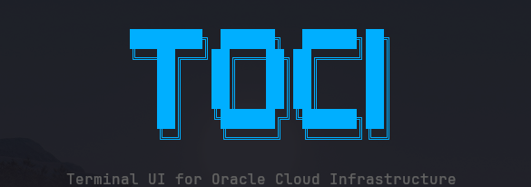

<p align="center">
  
</p>

# toci

터미널을 벗어나지 않고 Oracle Cloud Infrastructure(OCI)의 컴파트먼트, 컴퓨트, 네트워크, 데이터베이스 리소스를 빠르게 탐색/관리할 수 있는 키보드 중심 터미널 UI입니다.

[English](README.md)

기본값은 **읽기 전용**입니다. 쓰기 액션(인스턴스 start/stop, Bastion SSH 세션)은 명시적인 `--write` 플래그와, 리소스 이름을 직접 타이핑해야 하는 확인 절차 뒤에만 동작합니다.

## 기능

- **사이드바 리소스 트리** — Compartments(현재 드릴다운 경로 포함), VCN-scoped 리소스, Global-scoped 리소스가 왼쪽에 항상 표시됩니다.
- **컴파트먼트 탐색** — 지연(lazy) drill-down 방식 (`Enter`로 진입, `Esc`로 상위 복귀), 테넌시 전체 `inspect` 권한이 없어도 동작합니다.
- **VCN 스코프 필터링** — VCN을 하나 고르면 그 VCN에 속한 모든 리소스(Subnet, Route Table, Security List, NSG, Instance, Load Balancer, DB System, Autonomous DB, Exadata VM Cluster)가 자동으로 그 VCN 기준으로 필터링됩니다.
- **리소스 12종**: Compartments, Instances, VCNs, Subnets, Route Tables, Security Lists, NSGs, DRGs, Load Balancers, DB Systems, Autonomous Databases, Exadata VM Clusters.
- **Instance 테이블** — 실시간 CPU%/MEM%(OCI Monitoring), OCPU/메모리 스펙, Public/Private IP, AD/FD, RUNNING/STOPPED 상태를 배경색으로 표시.
- **Security List 규칙 뷰어** — ingress/egress 규칙을 중첩된 YAML 대신 읽기 쉬운 표로 보여줍니다.
- **CSV export** (UTF-8 BOM 포함, 엑셀에서 한글 안 깨짐) — 현재 화면에 보이는 내용 그대로 저장 (Security List 규칙 표도 export 가능).
- **Mermaid 다이어그램 export** — VCN의 서브넷별 구성(Instance/DB System/Autonomous DB/Exadata VM Cluster)과 그 VCN에 붙어있는 DRG까지 `graph TD` + 중첩 `subgraph` 문법의 `.mmd` 플로우차트로 생성합니다.
- **LazyVim 스타일 단축키 팝업** — `space`를 누르면 현재 화면에서 쓸 수 있는 모든 단축키가 우측 하단에 뜹니다.
- **리전 전환**, 로컬 퍼지 필터, 실시간 새로고침.
- **Bastion SSH** — 인스턴스의 private IP를 조회하고 Bastion 세션을 생성한 뒤 바로 SSH 셸로 진입합니다.

## 사전 준비

- Go 1.26 이상 (소스에서 직접 빌드할 때만 필요).
- `~/.oci/config`에 프로파일이 최소 1개 있어야 합니다 ([OCI CLI](https://docs.oracle.com/en-us/iaas/Content/API/SDKDocs/cliinstall.htm)와 동일한 설정 파일 사용).
- 조회하려는 리소스 타입에 대한 IAM `read`(또는 `--write` 사용 시 `manage`) 권한.

## 설치

순수 Go로 작성된 정적 바이너리라 `~/.oci/config` 외에 별도 런타임 의존성이 없습니다.

### 릴리즈에서 설치

```bash
curl -sL https://github.com/juseok1729/toci/releases/latest/download/toci-x86_64-unknown-linux-gnu.tar.gz | tar xz
sudo mv toci /usr/local/bin/
```

본인 플랫폼에 맞는 파일명으로 바꾸면 됩니다 — [Releases 페이지](https://github.com/juseok1729/toci/releases/latest)에서 확인 가능한 타겟:

| 플랫폼 | 타겟 |
| --- | --- |
| Linux x86_64 | `toci-x86_64-unknown-linux-gnu.tar.gz` |
| Linux arm64 | `toci-aarch64-unknown-linux-gnu.tar.gz` |
| macOS Intel | `toci-x86_64-apple-darwin.tar.gz` |
| macOS Apple Silicon | `toci-aarch64-apple-darwin.tar.gz` |

각 릴리즈엔 검증용 `checksums.txt`도 같이 올라갑니다.

### 소스에서 빌드

```bash
git clone git@github.com:juseok1729/toci.git
cd toci
go build -o toci ./cmd/toci
```

바이너리 크기를 줄이려면(릴리즈 빌드도 이 옵션을 씁니다):

```bash
go build -ldflags="-s -w" -trimpath -o toci ./cmd/toci
```

다른 플랫폼용으로는 `GOOS`/`GOARCH`로 크로스 컴파일하면 됩니다 (예: `GOOS=darwin GOARCH=arm64 go build ...`).

## 빠른 시작

```bash
./toci                                    # 프로파일: $OCI_CLI_PROFILE 또는 DEFAULT
./toci --profile ETEVERS                # 특정 프로파일
./toci --profile ETEVERS --region us-ashburn-1   # 리전 강제 지정 (기본: 프로파일의 region)
./toci --profile ETEVERS --write        # 쓰기 액션 활성화 (인스턴스 start/stop, Bastion SSH)
```

시작하면 테넌시 루트 컴파트먼트의 Compartments 목록이 뜹니다. `Enter`로 드릴다운하고, 하위 컴파트먼트가 없으면 자동으로 그 컴파트먼트의 VCN 목록으로 넘어갑니다.

## 키 바인딩

| 키 | 동작 |
| --- | --- |
| `j` / `k` (또는 방향키) | 위/아래 이동 |
| `Enter` | Compartment: 하위 진입 · VCN: 상세 보기 · 그 외: 상세(YAML) 보기 |
| `Esc` | 상세 닫기 → 필터 해제 → VCN 필터 해제 → 상위 컴파트먼트로 (해당되는 첫 번째 동작 실행) |
| `Tab` | 다음 리소스 종류로 순환 전환 |
| `:` | 사이드바 리소스 트리로 포커스 이동 |
| `/` | 현재 목록을 이름으로 필터링 |
| `r` | 리전 전환 (구독된 리전만) |
| `R` | 현재 목록 새로고침 |
| `t` | 사이드바 표시/숨김 |
| `e` | 현재 화면을 CSV로 export (UTF-8 BOM 포함) |
| `i` | *(VCN 행에서)* 모든 VCN-scoped 리소스를 이 VCN 기준으로 필터링 |
| `v` | *(Security List 행에서)* ingress/egress 규칙을 표로 보기 |
| `m` | *(VCN 필터가 걸려있을 때)* 그 VCN의 구성도를 Mermaid로 export |
| `a` | *(Instance, `--write` 필요)* 액션 메뉴 — start/stop, 타이핑 확인 필요 |
| `s` | *(Instance, `--write` 필요)* Bastion 경유 SSH |
| `space` | 단축키 팝업 토글 |
| `q` / `Ctrl-C` | 종료 |

## 문서

- [`docs/USAGE.md`](docs/USAGE.md) — 초기 사용 가이드
- [`docs/PROGRESS.md`](docs/PROGRESS.md) — 구현 현황 및 설계 결정 기록

## 라이선스

MIT — [LICENSE](LICENSE) 참고.
